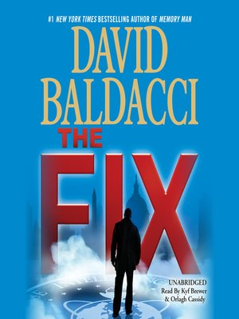

> **Everything happens for a reason!**
<!-- end -->

## Whats it about?

On a very random day, a well dressed random guy shoots a complete stranger in front of the FBI office and then kills himself. 
An officer with photographic memory and his team are assigned the case. 
Is there a link between the two people? Why did he kill her? and Why infront of the FBI office?
The officer and his team go on the lookout for answers!

## How is it?

Notice how many times I say words like "random", "strange" in the summary. The books starts off with a completely obscure setup and a murder. There is no obvious reasoning as to why it happens. The first few chapters reveal nothing about it too. It seems to proceed like a quest with no answers. The detectives start looking at the murder from different perspectives and yet are unable to figure out the reasoning behind the happenings. For me personally, this created a very intriguing setup as every possibility you think of as a reason for the murder is slowly eliminated. I really liked how the book started and how the first 100 pages created a perfect base for the further chapters.

As the story progressed, the answers were gradually revealed and the plot kept getting thicker. I loved the way the author made his characters deduce the answers. Like I said there were multiple questions in the initial setup. What I really liked was that the author took his time to reveal the answers and did not rush into revealing all of them at once. (Hence, the 600 odd pages rather than 300 to 400 which we normally see for thrillers.) Gradually all the pieces fit into the picture and by the end it made for a convincing explanation which I would say was definitely worth the wait.

My one liner for this book was that "Everything happens for a reason". Normally in books or movies pertaining to Murder Mysteries or in general mysteries, the amount of detailing is as much as what is needed or is important to the plot. I have often felt that when the author adds something extra to a scene at a place when it does not make sense, it usually ends up being an important thing later on. In this book, I felt that there was a lot of effort spent into the detailing in the initial parts. It almost became difficult to estimate which of these would be referenced later on and used in the deduction process. This added more to me in terms of the curiosity front. 

Not just this, every single question about the murder, Why him? Why her? Why there? Why at that time? All these are extremely crucial and I think that the effort put there into adding the details was amazing.

## The Characters

Apart from Amos Decker, around whom this series is centered, there are 3 other principal characters investigating or helping in the investigation of the case. Although Amos Decker is the series lead, there is equal contribution from all the other three into finding answers for the questions. Once again, I loved the detailing of the characters and their back stories as it fit perfectly into the plot. I do not want to reveal these details about the characters but it made perfect sense towards the end and I never felt like they were there for the sake of it. 

The other characters in the book the victim and the killer are also described in very good detail with good arcs. A considerable time is put into developing their traits and other personal details that we understand exactly what type of people they are. This aids a lot in understanding their actions.